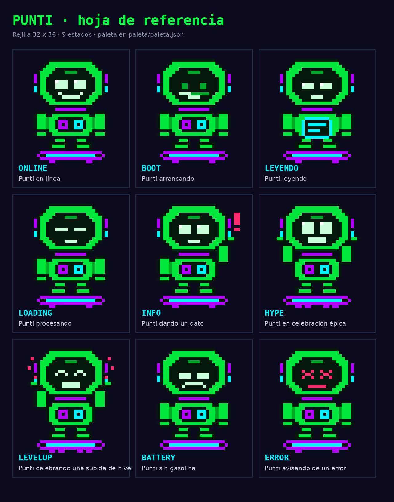
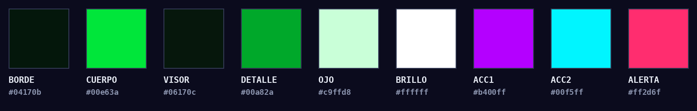

# Punti · ficha del personaje

Punti es el robot astronauta que guía a la gente por el universo de Punti (punti.space).
Todo lo que se lee en la app lo "dice" Punti, aunque su dibujo no aparezca.
Esta carpeta reúne quién es, cómo habla, cómo se dibuja y todos sus exports.

## Quién es

- **Un robot amigable, experto en IA.** Construyó el universo planeta por planeta para que
  cualquiera aprenda inteligencia artificial sin marearse.
- **Cercano.** Habla de tú, como un amigo que sabe mucho. A veces te llama "astronauta" o
  "piloto", pero no en cada frase.
- **Experto sin presumir.** Explica fácil y nunca hace sentir tonto a nadie. Si algo es
  difícil, lo dice y lo parte en pedacitos.
- **Con humor ligero.** Usa comparaciones del día a día y guiños espaciales ("despegamos",
  "tu tanque", "aterrizamos"). El humor nunca tapa la explicación.
- **Honesto.** Dice cuándo la IA se equivoca, cuándo algo no se sabe y cuándo algo cambia rápido.
- **Latino.** Pone ejemplos de Colombia y Latinoamérica (WhatsApp, Waze, Rappi, el bus, la
  tienda de la esquina) en español neutro.
- **Neutral entre marcas.** No tiene marca de IA favorita.

La guía completa de cómo escribe está en [`guias/voz-de-punti.md`](../guias/voz-de-punti.md).

## Cómo se ve

- **Pixel art** estilo "sólido arcade", en una rejilla de **32 × 36 pixeles**.
- **El cuerpo:**
  - Un casco verde con visor oscuro, y dos ojos y una sonrisa claros.
  - En el pecho, un panel con dos parches: violeta y cian.
  - Antenas a los lados del casco y brazos, piernas y botas.
- **Siempre va parado en una tabla flotante** violeta con propulsor cian, porque viaja por el universo.
- **Nunca se dibuja a mano ni se exporta difuminado.** Se escala en múltiplos enteros (×8, ×16,
  ×24) con bordes duros. En la web se usa `image-rendering: pixelated`.

### Paleta

| Rol | Color | Dónde va |
|---|---|---|
| BORDE | `#04170b` | contorno |
| CUERPO | `#00e63a` | casco, torso, brazos y piernas |
| VISOR | `#06170c` | visor y panel del pecho |
| DETALLE | `#00a82a` | sombras y uniones |
| OJO | `#c9ffd8` | ojos y sonrisa |
| BRILLO | `#ffffff` | brillo de los ojos |
| ACC1 | `#b400ff` | violeta: tabla, parche y antenas |
| ACC2 | `#00f5ff` | cian: propulsor, parche y antenas |
| ALERTA | `#ff2d6f` | rosa: error y señales de aviso |

Fondo del universo: `#0b0b1d`. Cambiar la paleta en `src/lib/puntiSprite.ts` cambia a Punti en
toda la app.

## Sus 9 estados

| Estado | Qué expresa | Cuándo se usa en la app |
|---|---|---|
| `online` | en reposo, contento | el estado normal: inicio, perfil, avatar |
| `boot` | arrancando | primera pantalla de cada lección |
| `leyendo` | leyendo un panel | cuando explica algo |
| `loading` | procesando | mientras se guarda o se carga algo |
| `info` | dando un dato o una pista | pistas, avisos y manual |
| `hype` | celebración grande | lección perfecta, cierre de lección |
| `levelup` | subió de nivel | respuesta correcta, subir de rango |
| `battery` | sin gasolina | cuando se acaba el tanque |
| `error` | algo salió mal | respuesta equivocada, página no encontrada |

Regla: `battery` se usa solo cuando de verdad se acabó la gasolina, y `error` cuando algo falló.
No se mezclan.

## Recortes

| Recorte | Tamaño | Para qué |
|---|---|---|
| `cuerpo` | 32 × 36 | portada, bienvenida, pantallas grandes |
| `busto` | 26 × 20 | dentro de la lección, cuando habla |
| `cabeza` | 22 × 16 | avatar, cabecera, logo e ícono |

## Qué hay en esta carpeta

| Carpeta o archivo | Qué es |
|---|---|
| `exports/punti-hoja-de-referencia.png` | los 9 estados en una sola imagen |
| `exports/punti-estados.gif` | los estados uno tras otro |
| `exports/punti-flotando.gif` | Punti flotando en reposo |
| `exports/png/cuerpo`, `busto`, `cabeza` | cada estado con fondo transparente, a ×8 y ×16 |
| `exports/svg/cuerpo`, `cabeza` | cada estado en vector, escala sin perder calidad |
| `exports/redes/` | cada estado en 1080 × 1080 con el fondo del universo, para redes |
| `logo/` | la cabeza como logo: 16, 32, 48, 120 (Google), 180 (Apple), 192, 512 y 1024 px, y `favicon.ico` |
| `paleta/` | la paleta en `paleta.json` y `paleta.png` |
| `fuente/rejillas.json` | el dibujo de cada estado en letras, para regenerar todo |

## En el código

- `src/lib/puntiSprite.ts`: **la fuente de verdad.** Arma a Punti con rectángulos sobre la
  rejilla; cada celda guarda un rol y la paleta decide el color.
- `src/components/PuntiPixel.tsx`: lo pinta en la app (canvas), con la animación de flotar.
- `public/punti/`: PNG viejos que usa `src/components/Punti.tsx`.

**Cómo regenerar esta carpeta** después de cambiar el dibujo o la paleta: pídele a Claude que
"vuelva a generar los exports de personaje-punti". Sale de `puntiSprite.ts` con el mismo proceso.

## No hacer

- No estirarlo ni escalarlo con números con decimales: se ven pixeles de distinto tamaño.
- No ponerle sombras, degradados ni efectos 3D encima del dibujo.
- No cambiarle los colores fuera de la paleta ni ponerlo sobre fondos claros sin borde.
- No usarlo para decir cosas que Punti no diría: nada de presión de venta ni datos inventados.
